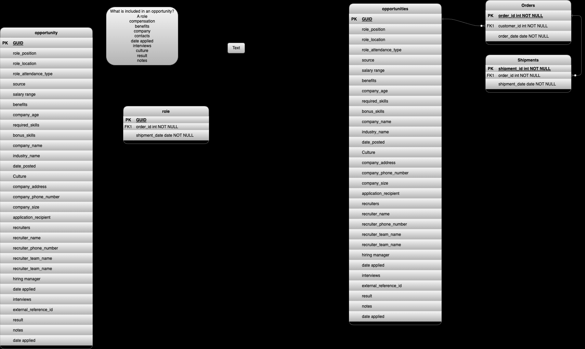

# job_opp_kb

A simple generalized job opportunities tracking app to help me start tracking job opps while I'm currently the searching for a new gig or for historical reference when searching in the future.  

## Design
- The data models and DB implementations will be prioritized
- Schema evolutions will be versioned
- TODO: Testing coverage will be XXX%
- No ORM's or frameworks will be used yet, however a loose coupling between the infrastructure, model, views, and application layers will be maintained to make a transition to a framework in the future as minimally invasive as possible.
- Using a relational db (PostgreSQL) to start as most of the anticipated data will be structured without too complicated of relationships and limited in number.

## job_opp Data Model (In Progress)

## TODO
- [ ] rename repo to something like `job_opp_kb`
- [ ] Add unit tests
- [ ] Backup database to some central location
- [ ] create an api for job opps CRUD
- [ ] create a ui for job opps CRUD
- [ ] host app for easier access on the go