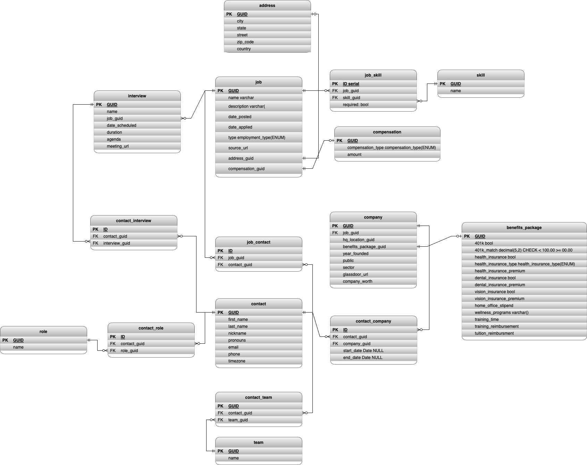

# job_opp_kb

A simple generalized job opportunities tracking app to help me start tracking job opps while I'm currently the searching for a new gig or for historical reference when searching in the future.  

## Design
- Schema evolutions will be versioned
- TODO: Testing coverage will be XXX%
- No ORM's or frameworks will be used yet, however a loose coupling between the infrastructure, model, views, and application layers will be maintained to make a transition to a framework in the future as minimally invasive as possible.
- Using a relational db (PostgreSQL) to start as most of the anticipated data will be structured without too complicated of relationships and limited in number.

### Data Model

Decisions:
- Prefer highly normalized structure, with single responsiblity and allow optionals to allow data to be filled as it becomes known throughout the lifecycle of an opportunity.
- Loose coupling between contact, company and job data to allow for future splitting into separate services.
- Multiple skills per job and multiple skills per job (allows skills to be re-used).
- Multiple contacts per company and a contact could be part of many companies.  Start and end dates will default to Null, Null end-date assumes current date.
- A Company only has one benefits package that applies to all jobs, can add a job_benefits junction table in future if needed.
- A Contact can have many roles and a role can have many contacts associated.
- A Job could have multiple interviews and each interviews could have multiple contacts that play different roles associated.
- Compensation is job sepecific and hourly vs salary will drive yearly_earnings, bonus and equity are mostly informational for now (see deferred section) and will drive potential_yearly_earnings.
- Use check constraints for character limits rather than varchar(x), see: https://stackoverflow.com/questions/4848964/difference-between-text-and-varchar-character-varying
- 

Deferred:

- How will a contact that is associated with two job opportunities playing different roles in each be disambiguated?  This seems like a rare case enough so that the user would be able to disambiguate just by seeing the jobs and roles associated with a particular contact. May require a job_role_contact junction as I don't want job sepecific roles to be owned by a non job sepecific contact service.
- Equity is included with Compensation, however will likely need a detailed formula with additional fields to find an accurate representation for true measurable comparisons.  For instance a companies worth, number of shares vs percentage, option vs stock, assume call type vs put, etc...  Same for Bonus, but probably less factors.
- Some data types will be determined during implementation.

## TODO
- [ ] rename repo to something like `job_opp_kb`
- [ ] Add unit tests
- [ ] Backup database to some central location
- [ ] create an api for job opps CRUD
- [ ] create a ui for job opps CRUD
- [ ] host app for easier access on the go